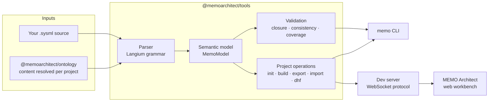

# How Tools Is Organized

Memo Tools is the engine of the MEMO stack: it parses text-first SysML v2 into
a semantic model, runs domain rules and closure checks, and exposes the result
to the `memo` CLI, the Architect workbench, and your own automation — all
through **one implementation**.

## The stack position

| Layer | Repository | Depends on |
|---|---|---|
| Ontology + Methodology | [memo](https://github.com/memoarchitect/memo) | SysML v2 only |
| **Tools (this repository)** | memo-tools | ontology content |
| Architect | [memo-architect](https://github.com/memoarchitect/memo-architect) | `@memoarchitect/tools` |

Dependency direction is strict: Tools never imports UI code, and the ontology
never depends on Tools. Core model behavior lives here so the CLI and Architect
call the same functions rather than reimplementing each other.

## One package, three entry points

`@memoarchitect/tools` publishes a single npm package with subpath exports.
The subpaths are hard boundaries, not conveniences:

| Export | Environment | Contents |
|---|---|---|
| `@memoarchitect/tools` | Node only | Project lifecycle (`initializeProject`, `validateProject`, …), parser, filesystem operations. Used by the CLI's own commands and by the Architect server. |
| `@memoarchitect/tools/browser` | Browser-safe | Pure model querying and diagram/view derivation. No Langium, no `node:*`, no server code. |
| `@memoarchitect/tools/types` | Anywhere | DTOs, WebSocket event schemas, and shared types — the protocol surface. |

The `memo` bin ships from this package; Architect ships its own
`memo-architect` bin. Neither package re-exposes the other's bin.

## Source map

Everything lives under `packages/tools/src`:

| Directory | Responsibility |
|---|---|
| `grammar/`, `language/` | Langium grammar and generated SysML v2 language services |
| `model/` | Semantic model (`MemoModel`), ontology loading, and package resolution |
| `validator/`, `completeness/` | Rule evaluation: closure, consistency, and coverage checks |
| `operations/` | Reusable project operations shared by CLI, server, and tests |
| `commands/`, `bin/` | The `memo` CLI as a thin adapter over operations |
| `server/`, `protocol/` | The dev server and the WebSocket contract Architect consumes |
| `import/`, `importer/`, `serializer/` | CSV/tool interchange in, JSON/DOT/package artifacts out |
| `dhf/`, `analysis/` | DHF generation and model analysis (impact, DSM) |
| `browser/`, `types/` | The two additional export surfaces described above |
| `ontology/`, `lock.ts` | Manifest reading, version pinning, and lock-file handling |
| `plugin/`, `llm/` | Plugin discovery and optional AI-assisted features |

## How ontology content is resolved

The engine contains **no content knowledge** — no package names, namespace
strings, archetype catalogs, or template layouts are hardcoded. Everything
comes from the ontology package's `memo.manifest.yaml`:

1. A project's `memo.package.yaml` declares `extends: "<logical package>"`.
2. The resolver locates the installed `@memoarchitect/ontology` package,
   reads its manifest, and maps the logical name to a subpath.
3. `memo.lock.yaml` pins the resolved identity and version; `memo validate`
   validates against the locked version.
4. If content cannot be resolved, commands fail with an actionable error —
   a lock file is never written against an unresolvable ontology chain.

In the `memo-meta` development workspace, the sibling `memo` checkout is
linked in place of the published package so ontology and engine changes can be
coordinated.

## Contract stability

Command output is stable at the supported interface boundary, and
machine-readable formats (JSON exports, protocol events) carry version-aware
contracts. The task documentation and interface tests describe the supported
behavior; anything not documented there is internal and may change.
