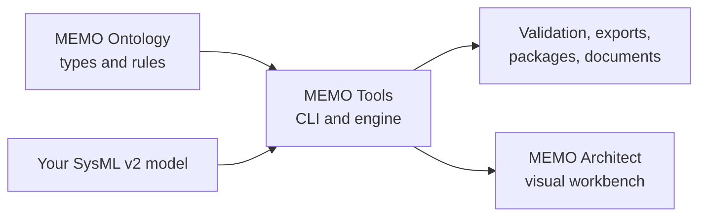

# Use MEMO from the command line

MEMO Tools turns SysML v2 source into a model you can validate, inspect, import,
export, package, and use in automation. It includes the `memo` command and the
reusable `@memo/tools` library.

Start with a task:

| Goal | Go to |
|---|---|
| Create a device-model project | [Install and Create a Project](start/install.md) |
| See value in a few minutes | [First Useful Workflow](start/first-workflow.md) |
| Find missing traceability | [Validate a Model](tasks/validate.md) |
| Bring in spreadsheet records | [Import Existing Data](tasks/import.md) |
| Generate JSON, DOT, DHF, or a package | [Export and Share](tasks/export.md) |
| Enforce model quality in a pipeline | [Run in CI](tasks/ci.md) |
| Find a command | [Command Map](reference/commands.md) |

## Where Tools fits

You can use Tools without Architect. Your `.sysml` files remain the source of
truth.
